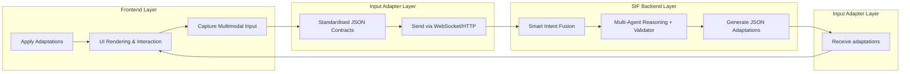

# A Multimodal AI-Driven GUI Framework for Dynamic User Adaptation

## Objective

This thesis presents a modular and scalable framework for **real-time, AI-driven user interface adaptation**, enabling personalised accessibility enhancements across diverse platforms such as **Flutter (desktop/mobile/web)**, **SwiftUI (Apple platforms)**, and future **VR/AR environments** (Unity).  
The framework fuses multimodal inputs — **touch, keyboard, voice, gestures** — with AI reasoning to dynamically modify UIs according to user needs, context, and interaction history.

At its core is **Smart Intent Fusion (SIF)**, a hybrid reasoning system combining **deterministic rules** with **multi-agent large language model (LLM)** reasoning. SIF interprets multimodal signals, user profiles, and recent interaction history to infer intent and propose targeted UI adaptations such as button enlargement, contrast adjustments, and input mode switching.

Designed to be **developer-friendly**, the system offers a standardised **JSON event/adaptation contract** and a cross-platform SDK. This makes integration minimal while allowing extensibility to future modalities like **eye tracking** and **brain–computer interfaces**.  
The long-term vision is to evolve towards **on-device, reinforcement-learned UI adaptation agents** capable of runtime and compile-time interface transformations.

---

## High-level Architecture Overview

The framework follows a **three-layer architecture** with a feedback loop for continuous personalisation:



**Data Flow Summary:**
1. **Frontend** captures multimodal inputs from the user.
2. **Input Adapter** standardises events into the **JSON Event Contract** and sends them to the backend.
3. **SIF Backend** fuses the event with user profile + history, applies rule-based logic and multi-agent LLM reasoning, and validates outputs.
4. **Frontend** applies the adaptation(s) and logs outcomes for future context.

---

## Components

### 1. Frontend Layer

- **Purpose**: Render the UI, capture interactions, and apply adaptations.
- **Cross-Platform**: Flutter (primary), SwiftUI (secondary), Unity (future).
- **Test/Demo UI**: “Adaptive Smart Home Controller” — scrollable cards with buttons and text.

**Supported Inputs:**
- **Touch/Tap** — detect taps/miss-taps.
- **Keyboard** — navigation (`Tab`) and selection (`Enter`).
- **Voice** — commands via speech-to-text (mocked if not integrated).
- **Gestures** — point/swipe via MediaPipe (mocked if not integrated).

**Example Adaptations:**
- Increase element size (`value: 1.5`).
- Increase contrast (`mode: high`).
- Adjust spacing.
- Switch input mode (`mode: voice`).

---

### 2. Input Adapter Layer

- **Purpose**: Convert raw multimodal input into the **Event JSON Contract**, as well as receiving adaptations and profile management for the frontend
- **Features**:
  - Ensures consistent schema regardless of modality.
  - Enriches events with `user_id`, `timestamp`, confidence score, and metadata.
  - Handles profile verification/creation before sending events.
  - Sends via WebSocket (low-latency) or HTTP (batch/profile ops).

**Event JSON Contract:**
```json
{
  "event_type": "tap",
  "source": "touch",
  "timestamp": "2025-08-09T14:22:00Z",
  "user_id": "user_123",
  "target_element": "lamp",
  "coordinates": {"x": 120, "y": 340},
  "confidence": 0.95,
  "metadata": {
    "command": "turn_on",
    "UI_element": "button",
  }
}
```

---

### 3. SIF Backend Layer

**Smart Intent Fusion (SIF)** — combines:
- **Rule-Based Logic**: deterministic fallbacks (e.g., miss-tap → enlarge button).
- **Multi-Agent LLM Reasoning (MA-SIF)**:
  - **UI Agent** — handles visual/UI changes.
  - **Geometry Agent** — handles spatial adjustments.
  - **Input Agent** — handles mode switching and input modality changes.
  - **Validator Agent** — merges, validates, and corrects agent outputs.

**Adaptation JSON Contract:**
```json
{
  "action": "increase_button_size",
  "target": "lamp_button",
  "value": 1.5,
  "reason": "User missed tapping the lamp button twice.",
  "intent": "increase target size"
}
```

**Profile Schema:**
```json
{
  "user_id": "user_123",
  "accessibility_needs": {
    "motor_impaired": true,
    "visual_impaired": false,
    "hands_free_preferred": true
  },
  "ui_preferences": {
    "font_size": 18,
    "contrast_mode": "normal",
    "button_size": 1.2
  },
  "interaction_history": [
    {"event_type": "miss_tap", "target": "lamp_button", "timestamp": "..."}
  ]
}
```

---

## Developer Integration

- **SDK**:
  - Pre-built templates and hooks (`sendEvent`, `onAdaptations`).
  - Minimal setup: 5–10 lines for basic inputs, advanced modalities enabled via config.
- **Example** (Flutter):
```dart
AdaptiveUI.sendEvent(
  'tap',
  element: 'lamp_button',
  coordinates: event.position,
  userId: 'user_123'
);
```

---

## Evaluation Plan

**Metrics:**
- Adaptation accuracy (precision/recall).
- Task completion time (simulated impairments).
- Latency (WebSocket round-trip).

**Case Studies:**
- Motor-impaired miss-tap scenario.
- Voice command hands-free scenario.

---

## Novelty & Impact

- **First** multimodal + LLM + multi-agent approach in adaptive accessibility UIs.
- JSON contracts ensure cross-platform/device generalisation.
- Profiles + history enable continuous personalisation.
- Extensible towards **on-device specialised AI** and **runtime UI rewriting**.

---

## Future Work

1. **On-Device Reasoning** — lightweight models for offline/private adaptation.
2. **Visual UI Understanding** — image models to “see” the UI for context.
3. **Reinforcement Learning from Feedback** — improve over time.
4. **Dual-Mode Adaptation** — compile-time + runtime.
5. **VR/AR Integration** — gaze + gesture-first adaptation.

