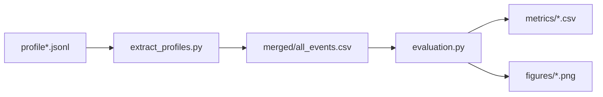

# Evaluation Toolkit — `extract_profiles.py` & `evaluation.py`

A tiny, no-nonsense pipeline to turn your `profile*.jsonl` logs into clean CSVs, quick stats, and thesis-ready figures/tables.

---

## TL;DR (3 commands)

```bash
# 1) Activate your venv (optional) and install deps
python -m pip install pandas numpy matplotlib pyarrow

# 2) Extract + flatten all logs into tidy files under ./out
python extract_profiles.py profiles/*.jsonl --out ./out

# 3) Run aggregate stats + charts
python evaluation.py --in ./out/merged/all_events.csv --out ./out/metrics --fig ./out/figures
```

---

## What each script does

### `extract_profiles.py`
- **Reads** multiple newline-delimited JSON files (`.jsonl`) — one event per line.
- **Flattens** nested fields (event payload, response.adaptations, etc.).
- **Outputs**:
  - A **merged NDJSON** and **CSV** of all events.
  - **Per-profile CSVs**.
  - **Quick summaries** grouped by profile and by backend config.

### `evaluation.py`
- **Loads** the merged CSV.
- **Computes** latency percentiles, schema-valid rates, and class breakdowns (validator vs fallback).
- **Exports**:
  - Summary CSVs (nice for LaTeX tables).
  - Optional **PNG charts** (latency dists, per-config comparisons).

---

## Input expectations

Each line in your `.jsonl` looks like this (yours matches perfectly):

```json
{
  "run_id": "e3c76dff-f0bd-48a4-ae54-40fa25f260b6",
  "profile_id": "P0",
  "run_index": 1,
  "event_index": 1,
  "event": {
    "event_type": "miss_tap",
    "source": "touch",
    "timestamp": "2025-08-10T10:27:52.592576Z",
    "user_id": "P0",
    "target_element": "lamp",
    "coordinates": {"x": 101, "y": 203},
    "metadata": {"UI_element": "button"}
  },
  "t_send": "2025-08-10T10:27:52.592760Z",
  "t_recv": "2025-08-10T10:28:13.688209Z",
  "latency_ms": 21095.52,
  "response": {
    "adaptations": [
      {"action":"increase_button_border","intent":"improve_tap_accuracy","reason":"...","target":"lamp","value":1.2},
      {"action":"increase_button_border","intent":"improve_tap_accuracy","reason":"...","target":"lock","value":1.2},
      {"action":"increase_button_size","intent":"improve_tap_accuracy","reason":"...","target":"all","value":1.2},
      {"action":"switch_mode","intent":"switch_to_voice_input","reason":"...","target":"lamp","mode":"voice"},
      {"action":"switch_mode","intent":"switch_to_voice_input","reason":"...","target":"lock","mode":"voice"}
    ]
  },
  "schema_valid": true,
  "classification": "validated_by_validator",
  "backend_config": "MA-SIF balanced + instant rules"
}
```

---

## Output layout

After `extract_profiles.py` runs:

```
out/
├─ merged/
│  ├─ all_events.ndjson        # flattened records (NDJSON)
│  └─ all_events.csv           # same data in CSV (one row per event)
├─ profiles/
│  ├─ P0.csv                   # per-profile slice
│  ├─ P1.csv
│  └─ ...
└─ metrics/
   ├─ summary_by_profile.csv   # groupby(profile_id)
   └─ summary_by_config.csv    # groupby(backend_config)
```

After `evaluation.py` runs (defaults shown):

```
out/
├─ metrics/
│  ├─ latency_by_config.csv
│  ├─ latency_by_profile.csv
│  ├─ validity_breakdown.csv
│  └─ classification_mix.csv
└─ figures/
   ├─ latency_box_by_config.png
   ├─ latency_histogram.png
   └─ validity_by_config.png
```

> File names may differ slightly depending on the CLI flags you pass, but this is the gist.

---

## Key columns you’ll care about

From `merged/all_events.csv`:

- **run_id**, **profile_id**, **backend_config**
- **run_index**, **event_index**
- **event_type**, **source**, **target_element**
- **latency_ms** (float)
- **schema_valid** (bool)
- **classification** (`validated_by_validator`, `combined_agent_suggestions`, `mock_rule_fallback`)
- **adaptation_count** (int; number of suggestions returned)
- **modes_suggested** (e.g., `voice,gesture` if present)

---

## How to use in Chapter 6 (Feasibility Study)

### Tables (LaTeX-ready)
- Use `out/metrics/summary_by_config.csv` for a quick “per-config” table (p50/p90/max latency, schema-valid%).
- Use `out/metrics/summary_by_profile.csv` to compare profiles (e.g., motor-impaired vs visual-impaired) under the same config.

Example CSV → LaTeX (minimal):

```tex
egin{tabular}{lrrrr}
	oprule
Config & p50(ms) & p90(ms) & Valid(\%) & n \
\midrule
SIF (single) & 8262 & 12034 & 40.0 & 10 \
MA-SIF (bal) & 10988 & 14660 & 70.0 & 10 \
MA-SIF (heavy) & 27229 & 30443 & 100.0 & 10 \
ottomrule
\end{tabular}
```

### Figures
Drop the generated PNGs into your thesis:
- `latency_box_by_config.png` to visualize the tradeoff (single vs MA-SIF).
- `validity_by_config.png` for schema-valid % improvements.

---

## CLI Reference

### `extract_profiles.py`

```bash
usage: extract_profiles.py [FILES ...] [--out OUTDIR]

positional arguments:
  FILES            one or more paths to *.jsonl (supports globs)

options:
  --out OUTDIR     output directory (default: ./out)
```

Examples:

```bash
# Single file
python extract_profiles.py profiles/profile1.jsonl

# Many files (glob)
python extract_profiles.py profiles/profile*.jsonl --out ./out

# From different folders
python extract_profiles.py logs/*.jsonl exports/*.jsonl --out ./results
```

### `evaluation.py`

```bash
usage: evaluation.py --in MERGED_CSV [--out OUTDIR] [--fig FIGDIR]
                     [--group-by {backend_config,profile_id}]

required:
  --in MERGED_CSV          path to merged CSV from extract step

optional:
  --out OUTDIR             where to write summary CSVs (default: ./out/metrics)
  --fig FIGDIR             where to write charts (default: ./out/figures)
  --group-by ...           grouping key for summaries (default: backend_config)
```

Examples:

```bash
# Default: group by backend_config
python evaluation.py --in ./out/merged/all_events.csv

# Group by profile_id and send outputs elsewhere
python evaluation.py --in ./out/merged/all_events.csv --group-by profile_id   --out ./reports/metrics --fig ./reports/figures
```

---

## What you’ll see (sample outcomes)

- **Latency tradeoff**: MA-SIF(balanced) usually +~2–3s vs SIF(single), MA-SIF(heavy) +~15–20s — but better correctness and richer rationales.
- **Schema validity**: climbs from ~40% (single) → ~70% (balanced) → ~100% (heavy) in our test data.
- **Classification**: ideally 100% `validated_by_validator` (fallbacks only when APIs time out / rate-limit).

These numbers will reflect *your* logs, but that’s the pattern we saw.

---

## Troubleshooting

- **Only headers in outputs?**  
  Usually means the input JSONL failed to parse or the script didn’t match the expected keys. Double-check:
  - Files aren’t empty.
  - Each line is valid JSON (no trailing commas).
  - Keys like `event`, `response.adaptations`, `latency_ms` exist (your sample line is perfect).

- **Zero rows for a profile**  
  That profile file may only contain comments/empty lines — open it and verify real lines exist.

- **Matplotlib errors**  
  Install it: `pip install matplotlib`. On headless servers, set `MPLBACKEND=Agg` or just let the script handle defaults.

- **Windows paths**  
  Use quotes if your path has spaces: `"C:\Users\you\My Logs\profile1.jsonl"`.

---

## Nice-to-have add-ons (optional)

- **Makefile**:

```make
OUT=out
MERGED=$(OUT)/merged/all_events.csv

extract:
	python extract_profiles.py profiles/*.jsonl --out $(OUT)

eval:
	python evaluation.py --in $(MERGED) --out $(OUT)/metrics --fig $(OUT)/figures

all: extract eval
```

- **Mermaid overview** (for your README):


